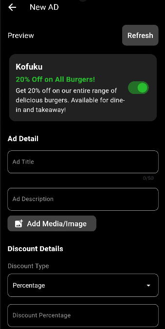
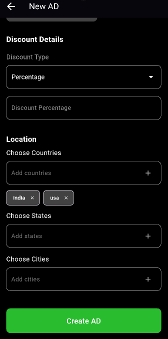

# Advertisement Manager

## Overview
The **Advertisement Manager** is a Flutter-based application that allows users to manage advertisements effectively. The app supports features like creating new ads, editing existing ones, filtering ads based on their status, and searching through ads. The app is responsive and works seamlessly across different screen sizes.

---

## Features

1. **Create Advertisements**
    - Add new advertisements with details like title, description, discount type, and more.

2. **Edit Advertisements**
    - Modify details of existing advertisements directly from the list.

3. **Tab-Based Filtering**
    - Switch between different tabs to filter ads based on their status (Active, Inactive, Expired, All).

4. **Search and Filter**
    - Search advertisements using the search bar and apply filters.

5. **Responsive Design**
    - The app adapts to various screen sizes and orientations for an optimal user experience.

---

## Screenshots

### 1. Advertisement Page


### 2. Active & InActive Tabs


### 3. Create Advertisement




---

## Folder Structure

```
lib/
├── components/                # Reusable components used across the app
│   ├── ad_card.dart           # UI for individual advertisement cards
│   ├── bottom_nav_bar.dart    # Bottom navigation bar
│   ├── create_ad_button.dart  # Button to create a new advertisement
│   ├── CustomDropdown.dart    # Custom dropdown widget
│   ├── search_bar_with_filter.dart # Search bar with filter button
│   └── tabs_bar.dart          # Tab bar for filtering ads
├── pages/                     # Screens/pages of the application
│   ├── advertisement_page.dart # Main page displaying the ads
│   ├── EditAdvertisement.dart # Page for editing an advertisement
│   └── NewAdPage.dart         # Page for creating a new advertisement
└── main.dart                  # Entry point of the application
```

---

## Application Flow

1. **Main Entry Point (`main.dart`)**
    - Initializes the app and sets `AdvertisementPage` as the home screen.

2. **Main Page (`advertisement_page.dart`)**
    - Displays a list of advertisements categorized into tabs.
    - Includes components like:
        - `CreateAdButton` for navigating to the new ad creation page.
        - `TabsBar` for filtering ads based on status.
        - `SearchBar` for searching through ads.
        - `AdCard` for displaying individual ad details.
        - `BottomNavBar` for navigation.

3. **Edit Page (`EditAdvertisement.dart`)**
    - Allows editing of existing advertisements.

4. **New Ad Page (`NewAdPage.dart`)**
    - Provides a form to create new advertisements.
    - Includes a custom dropdown and chip input fields for location selection.

---

## How to Run

1. **Clone the Repository:**
   ```bash
   git clone <repository-url>
   ```

2. **Navigate to the Project Directory:**
   ```bash
   cd advertisement_manager
   ```

3. **Install Dependencies:**
   ```bash
   flutter pub get
   ```

4. **Run the App:**
   ```bash
   flutter run
   ```

---

## Dependencies

- [Flutter](https://flutter.dev/)
- Ensure all assets (e.g., `project_images`) are correctly added to the `pubspec.yaml` file:

  ```yaml
  flutter:
    assets:
      - project_images/img.png
      - project_images/img_1.png
      - project_images/img_2.png
      - project_images/img_3.png
  ```

---

## License
This project is licensed under the MIT License. See the LICENSE file for details.

